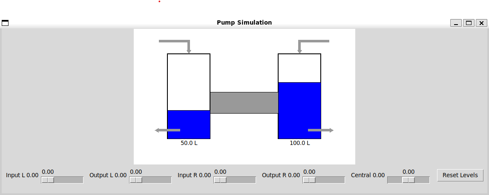

# Simulation Example

Source example: `examples/sim_examples/server/basic_sim_server.py`

This example combines an OPC UA server with a small GUI simulation. The server variables drive the same process state that the local interface displays, so it works as both a demo and an integration example.



## Explanation

### Creating the simulation variables

The script creates five floating-point variables with explicit string NodeIds.

```python
pump_li_open = s.add_variable("pumpLiOpen", s.objects_node, 0.0, nodeid="ns=1;s=PumpLIOpen")
pump_lo_open = s.add_variable("pumpLoOpen", s.objects_node, 0.0, nodeid="ns=1;s=PumpLOOpen")
pump_ri_open = s.add_variable("pumpRiOpen", s.objects_node, 0.0, nodeid="ns=1;s=PumpRIOpen")
pump_ro_open = s.add_variable("pumpRoOpen", s.objects_node, 0.0, nodeid="ns=1;s=PumpROOpen")
pump_c_open = s.add_variable("pumpCOpen", s.objects_node, 0.0, nodeid="ns=1;s=PumpCOpen")
```


### Connecting the GUI to the server

The variables are passed directly into `gui_pump.initialize_from_server(...)`, so the local UI and remote OPC UA clients operate on the same server-side objects.

```python
gui_pump.initialize_from_server(
	s,
	pump_li_open,
	pump_lo_open,
	pump_ri_open,
	pump_ro_open,
	pump_c_open,
	dt,
)
```

### Running the application loop

After initialization, the example starts the server and then hands control to the GUI loop. The server stays active until the window closes or the process is interrupted.

```python
s.start()

try:
	gui_pump.root.mainloop()
finally:
	s.stop()
```

## Full source

```python
from o6.server import Server
try:
	from . import gui_pump
except ImportError:
	import gui_pump

s = Server(port=4840)
tank_left = 50.0
tank_right = 100.0
tank_capacity = 150.0
flow_constant = 3.0

pump_li_open = s.add_variable("pumpLiOpen", s.objects_node, 0.0, nodeid="ns=1;s=PumpLIOpen")
pump_lo_open = s.add_variable("pumpLoOpen", s.objects_node, 0.0, nodeid="ns=1;s=PumpLOOpen")
pump_ri_open = s.add_variable("pumpRiOpen", s.objects_node, 0.0, nodeid="ns=1;s=PumpRIOpen")
pump_ro_open = s.add_variable("pumpRoOpen", s.objects_node, 0.0, nodeid="ns=1;s=PumpROOpen")
pump_c_open = s.add_variable("pumpCOpen", s.objects_node, 0.0, nodeid="ns=1;s=PumpCOpen")

dt = 1.0

gui_pump.initialize_from_server(
	s,
	pump_li_open,
	pump_lo_open,
	pump_ri_open,
	pump_ro_open,
	pump_c_open,
	dt,
)


def shutdown():
	gui_pump.root.quit()
	gui_pump.root.destroy()


gui_pump.refresh_controls()
gui_pump.draw_system()
gui_pump.update_simulation()

gui_pump.root.protocol("WM_DELETE_WINDOW", shutdown)

s.start()
print("Server running at opc.tcp://localhost:4840")
print("Close the window or press Ctrl+C to stop.\n")

try:
	gui_pump.root.mainloop()
except KeyboardInterrupt:
	print("\nShutting down...")
finally:
	s.stop()
	print("Server stopped.")
```
