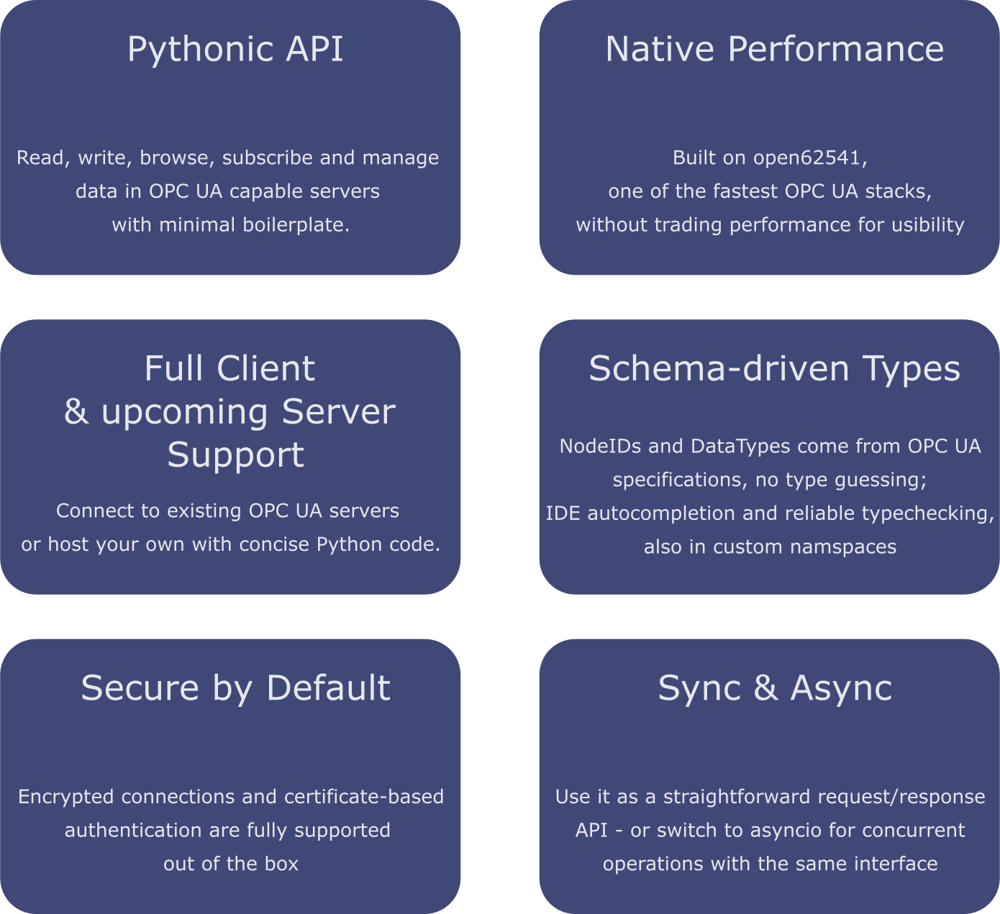

# o6-python — OPC UA for Python

**o6-python** is a high-performance Python library for OPC UA, built on top of [open62541](https://open62541.org/) — one of the most battle-tested open-source OPC UA stacks. It gives you a clean, Pythonic API for both client and server use cases, without sacrificing the reliability or speed of native C.

## Key Features at a Glance

  

<!--
- **Full client & upcoming server support** — connect to existing OPC UA servers or build your own, all with just a few lines of Python code
- **Pythonic API** — read, write, browse, subscribe to data changes and events with minimal boilerplate
- **Native performance** — built on open62541, one of the fastest OPC UA implementations available, with no performance compromises
- **Schema-driven types** — node IDs and data types are sourced directly from OPC UA specifications, so there is no type guessing; full IDE autocompletion and mypy compatibility are included, and custom namespaces are supported too
- **Secure by default** — encrypted connections and certificate-based authentication are fully supported out of the box
- **Sync & async** — use it as a straightforward request/response API, or switch to `asyncio` for concurrent operations — with identical API
-->

## Where to Find What

| Section | What you'll find |
|---|---|
| [Quick Start](quick_start.md) | Install, connect to a server, read your first value |
| [Client](client.md) | Full client API guide — sessions, subscriptions, browsing, events |
| [Server](server.md) | Building an OPC UA server — nodes, variables, methods, namespaces |
| [API Reference](api_reference/index.md) | Auto-generated reference for all public classes and functions |
| [Core Concepts](core-concepts.md) | OPC UA concepts explained: nodes, addresses, data types, security |
| [Examples](examples/client-basic.md) | Runnable code examples for common use cases |

