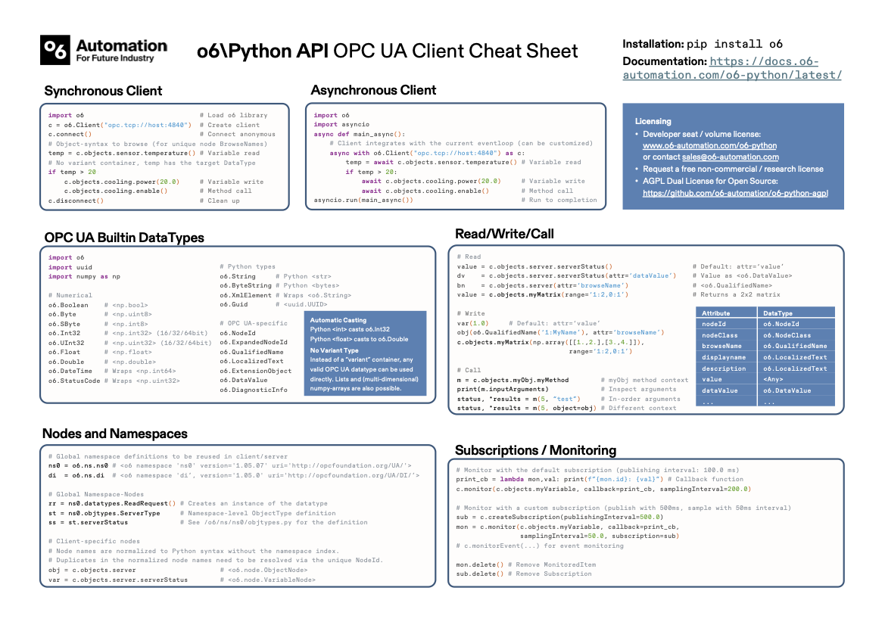

# o6\\Python — OPC UA for Python

**o6\Python** is a high-performance Python library for OPC UA, built on top of the native [open62541](https://open62541.org/) SDK. It gives you a clean, Pythonic API for both client and server use cases, without sacrificing the reliability or speed of native C.

  
Install with one command: <code>pip install o6</code>

  
(Trial Version Restarts Every 2 Hours)

## Key Advantages

1. **Native Python API:** Automatic mapping between Python and OPC UA objects, object types, datatypes, and so on.
2. **Native Speed:** The underlying C SDK unlocks native performance with Python convenience.
3. **Companion Specifications Included:** More than 130 OPC UA companion specifications come included with o6\Python. Additional nodesets can be easily loaded with the provided tooling.
4. **Certification Ready:** A feature-complete and battle-hardened foundation for bringing your applications into official certification.
5. **Professionally Developed and Supported:** o6\Python is professionally developed, maintained, and supported by [o6 Automation](https://www.o6-automation.com/o6-python). As the SDK manufacturer, o6 Automation stands behind the product and fulfills their CRA and cybersecurity obligations. Training, long-term support, and certification assistance are also available.

## o6\Python Cheatsheet

  

## Licensing

- **Developer seat / volume license:** Visit the [o6\Python product page](https://www.o6-automation.com/o6-python/) or contact [sales@o6-automation.com](mailto:sales@o6-automation.com).
- **Non-commercial / research use:** Request a free license.
- **Open-source use:** o6\Python is available under an [AGPL dual license](https://github.com/o6-automation/o6-python-agpl).

<!--
- **Full client & upcoming server support** — connect to existing OPC UA servers or build your own, all with just a few lines of Python code
- **Pythonic API** — read, write, browse, subscribe to data changes and events with minimal boilerplate
- **Native performance** — built on open62541, one of the fastest OPC UA implementations available, with no performance compromises
- **Schema-driven types** — node IDs and data types are sourced directly from OPC UA specifications, so there is no type guessing; full IDE autocompletion and mypy compatibility are included, and custom namespaces are supported too
- **Secure by default** — encrypted connections and certificate-based authentication are fully supported out of the box
- **Sync & async** — use it as a straightforward request/response API, or switch to `asyncio` for concurrent operations — with identical API
-->

## Where to Find What

| Section | What you'll find |
|---|---|
| [OPC UA Fundamentals](manual/opcua-fundamentals/index.md) | OPC UA concepts explained: nodes, addresses, data types, security |
| [Node API](manual/node-api.md) | Explore live node access and Pythonic UA objects |
| [Client](manual/client/index.md) | Full client API guide — sessions, subscriptions, browsing, events |
| [Server](manual/server/index.md) | Building an OPC UA server — nodes, variables, methods, namespaces |
| [Commercial build](home/commercial-build.md) | Evaluation mode and Credential discovery for PyPI wheels |
| [Memory management](manual/sdk-fundamentals/memory-management.md) | Ownership and garbage-collection strategy across Python and the native SDK |
| [API Reference](api_reference/index.md) | Reference for all public classes and functions |
| [Examples](examples/client-basic.md) | Runnable code examples for common use cases |
