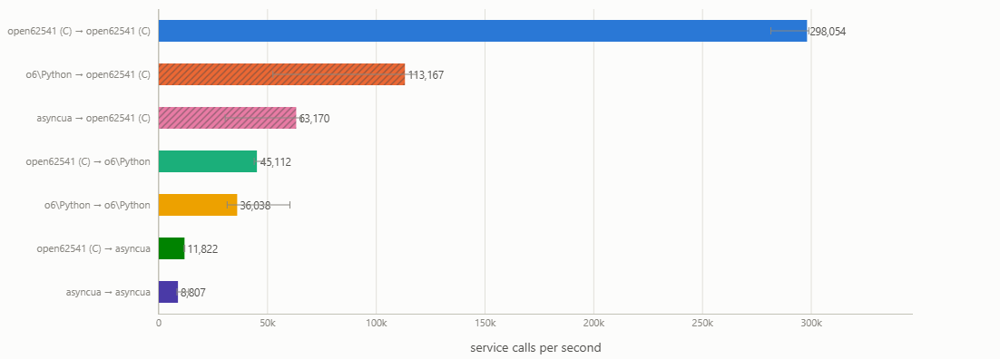
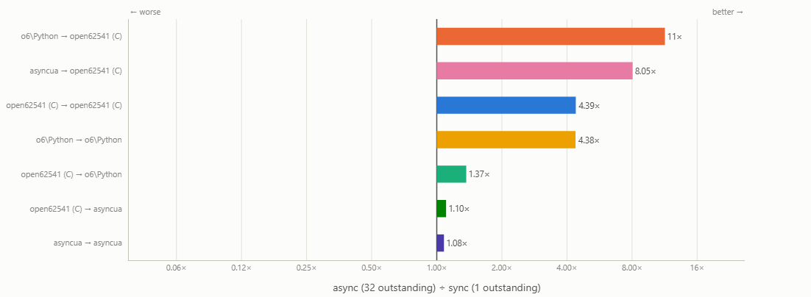
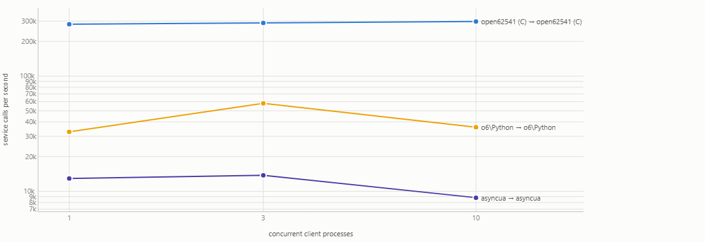
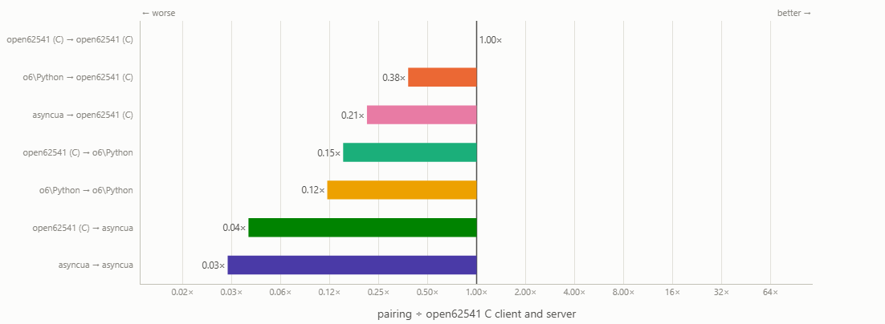

# Performance

The end-to-end benchmark compares native open62541 C, o6\Python, and asyncua as
OPC UA clients and servers. Both roles are varied independently, so client-side
and server-side cost can be attributed separately. Seven pairings are measured:

| Client / server | Purpose |
| --- | --- |
| C / C | Native baseline |
| o6 / C and C / o6 | Isolate the o6 client and server |
| asyncua / C and C / asyncua | Isolate the asyncua client and server |
| o6 / o6 and asyncua / asyncua | Complete Python applications on both sides |

Each client is a separate process. All configurations access the same 100
writable `Int32` variables using the same NodeId sequence and a common process
barrier, one value per service call. Node objects are resolved before timing.
Every figure below is the median aggregate throughput across five samples;
every client performs 2,000 operations after 100 warm-up operations.

Async clients keep at most 32 application requests open independently. The
total limits are therefore 32, 96, and 320 outstanding requests for one, three,
and ten client processes.

All rates are OPC UA service calls per second. Larger is better.

## Aggregate throughput

Ten concurrent client processes, up to 32 requests in flight per client, reads,
SecurityPolicy `#None`:

| Role | o6\Python | asyncua | Ratio |
| --- | ---: | ---: | ---: |
| Client, against a C server | 113.2k | 63.2k | 1.8× |
| Server, driven by C clients | 45.1k | 11.8k | 3.8× |
| Python client and server | 36.0k | 8.8k | 4.1× |

The native C pairing reaches 298.1k calls/s in the same configuration. The
difference between the two Python stacks is larger in the server role than in
the client role.

## Effect of request pipelining

Async throughput (32 requests outstanding) divided by sync throughput (1
outstanding), per pairing, at ten clients:

The native pairing's lower multiplier follows from its synchronous baseline, which is the highest sync figure in the matrix.

Server-side pairings gain least - effectively constant across a
thirty-fold change in outstanding requests. 

## Scaling with client count

Both Python pairings peak at three clients and decline at ten. Ten client
processes plus a server process on twelve logical CPUs is oversubscribed, and
the ten-client samples scatter accordingly, the native pairing stays flat.
At their respective peaks the two Python pairings differ by a factor of 4.2×.

## Relative to the native baseline

Each pairing divided by the native baseline (server and client implementation in `C`)

| Role | o6\Python | asyncua |
| --- | ---: | ---: |
| Client, against a C server | 38% | 21% |
| Server, driven by C clients | 15% | 4% |
| Python client and server | 12% | 3% |

# Test system

Recorded on 6 August 2026, 05:52 UTC with the following hardware:

| Component | Configuration |
| --- | --- |
| Processor | 13th Gen Intel Core i5-1345U, 12 logical processors |
| Memory | 16 GB (15.45 GiB reported) |
| Operating system | Linux 6.6.87.2-microsoft-standard-WSL2, x86_64, glibc 2.39 |
| Python | CPython 3.12.3 |
| Transport | OPC UA TCP over loopback |