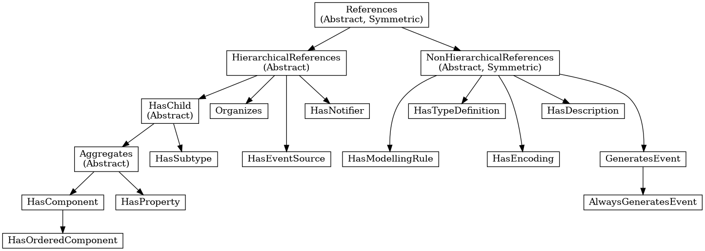

# Information Modelling

Information modelling in OPC UA combines concepts from object-orientation and semantic modelling. At the core, an OPC UA information model is a graph consisting of Nodes and References between them.

## Nodes

There are eight possible NodeClasses for Nodes (Variable, VariableType, Object, ObjectType, ReferenceType, DataType, Method, View). The NodeClass defines the attributes a Node can have.

## References

References are links between Nodes. References are typed (refer to a ReferenceType) and directed.

The original source for the following information is [Part 3 of the OPC UA specification](https://reference.opcfoundation.org/Core/Part3/).

Each Node is identified by a unique (within the server) NodeId and carries different attributes depending on the NodeClass. These attributes can be read (and sometimes also written) via the OPC UA protocol. The protocol further allows the creation and deletion of Nodes and References at runtime. But this is not supported by all servers.

Reference are triples of the form (source-nodeid, referencetype-nodeid, target-nodeid). (The target-nodeid is actually an ExpandedNodeId which is a NodeId that can additionally point to a remote server.) An example reference between nodes is a hasTypeDefinition reference between a Variable and its VariableType. Some ReferenceTypes are hierarchical and must not form directed loops. See the section on ReferenceTypes for more details on possible references and their semantics.

The following table (adapted from Part 3 of the specification) shows which attributes are mandatory (M), optional (O) or not defined for each NodeClass. In open62541 all optional attributes are defined - with sensible defaults if users do not change them.

| Attribute                 | Type                      | Variable | VariableType | Object | ObjectType | ReferenceType | DataType | Method | View  |
|---                        |---                        |---       |---           |---     |---         |---            |---       |---     |---    |
| NodeId                    | NodeId                    | M        | M            | M      | M          | M             | M        | M      | M     |
| NodeClass                 | NodeClass                 | M        | M            | M      | M          | M             | M        | M      | M     |
| BrowseName                | QualifiedName             | M        | M            | M      | M          | M             | M        | M      | M     |
| DisplayName               | LocalizedText             | M        | M            | M      | M          | M             | M        | M      | M     |
| Description               | LocalizedText             | O        | O            | O      | O          | O             | O        | O      | O     |
| WriteMask                 | UInt32 (Write Masks)      | O        | O            | O      | O          | O             | O        | O      | O     |
| UserWriteMask             | UInt32                    | O        | O            | O      | O          | O             | O        | O      | O     |
| IsAbstract                | Boolean                   |          | M            |        | M          | M             | M        |        |       |
| Symmetric                 | Boolean                   |          |              |        |            | M             |          |        |       |
| InverseName               | LocalizedText             |          |              |        |            | O             |          |        |       |
| ContainsNoLoops           | Boolean                   |          |              |        |            |               |          |        | M     |
| EventNotifier             | Byte (EventNotifier)      |          |              | M      |            |               |          |        | M     |
| Value                     | Variant                   | M        | O            |        |            |               |          |        |       |
| DataType                  | NodeId                    | M        | M            |        |            |               |          |        |       |
| ValueRank                 | Int32 (ValueRank)         | M        | M            |        |            |               |          |        |       |
| ArrayDimensions           | \[UInt32\]                | O        | O            |        |            |               |          |        |       |
| AccessLevel               | Byte (Access Level Masks) | M        |              |        |            |               |          |        |       |
| UserAccessLevel           | Byte                      | M        |              |        |            |               |          |        |       |
| MinimumSamplingInterval   | Double                    | O        |              |        |            |               |          |        |       |
| Historizing               | Boolean                   | M        |              |        |            |               |          |        |       |
| Executable                | Boolean                   |          |              |        |            |               |          | M      |       |
| UserExecutable            | Boolean                   |          |              |        |            |               |          | M      |       |
| DataTypeDefinition        | DataTypeDefinition        |          |              |        |            |               | O        |        |       |

Each attribute is referenced by a numerical Attribute Id.

Some numerical attributes are used as bitfields or come with special semantics. In particular, see the sections on Access Level Masks, Write Masks, ValueRank and EventNotifier.

New attributes in the standard that are still unsupported in open62541 are RolePermissions, UserRolePermissions, AccessRestrictions and AccessLevelEx.

## VariableNode

Variables store values in a DataValue together with metadata for introspection. Most notably, the attributes data type, value rank and array dimensions constrain the possible values the variable can take on.

Variables come in two flavours: properties and datavariables. Properties are related to a parent with a `hasProperty` reference and may not have child nodes themselves. Datavariables may contain properties (`hasProperty`) and also datavariables (`hasComponents`).

All variables are instances of some VariableTypeNode in return constraining the possible data type, value rank and array dimensions attributes.

### Data Type

The (scalar) data type of the variable is constrained to be of a specific type or one of its children in the type hierarchy. The data type is given as a NodeId pointing to a DataTypeNode in the type hierarchy. See the Section DataTypeNode for more details.

If the data type attribute points to `UInt32`, then the value attribute must be of that exact type since `UInt32` does not have children in the type hierarchy. If the data type attribute points `Number`, then the type of the value attribute may still be `UInt32`, but also `Float` or `Byte`.

Consistency between the data type attribute in the variable and its VariableTypeNode is ensured.

### ValueRank

This attribute indicates whether the value attribute of the variable is an array and how many dimensions the array has. It may have the following values:

- `n >= 1`: the value is an array with the specified number of dimensions
- `n = 0`: the value is an array with one or more dimensions
- `n = -1`: the value is a scalar
- `n = -2`: the value can be a scalar or an array with any number of dimensions
- `n = -3`: the value can be a scalar or a one dimensional array

The consistency between the value rank attribute of a VariableNode and its VariableTypeNode is tested within the server.

### Array Dimensions

If the value rank permits the value to be a (multi-dimensional) array, the exact length in each dimensions can be further constrained with this attribute.

- For positive lengths, the variable value must have a dimension length less or equal to the array dimension length defined in the VariableNode.
- The dimension length zero is a wildcard and the actual value may have any length in this dimension. Note that a value (variant) must have array dimensions that are positive (not zero).

Consistency between the array dimensions attribute in the variable and its VariableTypeNode is ensured. However, we consider that an array of length zero (can also be a null-array with undefined length) has implicit array dimensions `[0,0,...]`. These always match the required array dimensions.

## VariableTypeNode

VariableTypes are used to provide type definitions for variables. VariableTypes constrain the data type, value rank and array dimensions attributes of variable instances. Furthermore, instantiating from a specific variable type may provide semantic information. For example, an instance from `MotorTemperatureVariableType` is more meaningful than a float variable instantiated from `BaseDataVariable`.

## ObjectNode

Objects are used to represent systems, system components, real-world objects and software objects. Objects are instances of an object type and may contain variables, methods and further objects.

## ObjectTypeNode

ObjectTypes provide definitions for Objects. Abstract objects cannot be instantiated. Declared Python ObjectTypes can extend instance construction with an ordinary `__init__` that calls `super().__init__(...)` before adding application state.

## ReferenceTypeNode

Each reference between two nodes is typed with a ReferenceType that gives meaning to the relation. The OPC UA standard defines a set of ReferenceTypes as a mandatory part of OPC UA information models.

- Abstract ReferenceTypes cannot be used in actual references and are only used to structure the ReferenceTypes hierarchy.
- Symmetric references have the same meaning from the perspective of the source and target node.

The figure below shows the hierarchy of the standard ReferenceTypes (arrows indicate a `hasSubType` relation). Refer to Part 3 of the OPC UA specification for the full semantics of each ReferenceType.

The ReferenceType hierarchy can be extended with user-defined ReferenceTypes. Many Companion Specifications for OPC UA define new ReferenceTypes to be used in their domain of interest.

For the following example of custom ReferenceTypes, we attempt to model the structure of a technical system. For this, we introduce two custom ReferenceTypes.

First, the hierarchical `contains` ReferenceType indicates that a system (represented by an OPC UA object) contains a component (or subsystem). This gives rise to a tree-structure of containment relations. For example, the motor (object) is contained in the car and the crankshaft is contained in the motor. Second, the symmetric `connectedTo` ReferenceType indicates that two components are connected. For example, the motor's crankshaft is connected to the gear box. Connections are independent of the containment hierarchy and can induce a general graph-structure. Further subtypes of `connectedTo` could be used to differentiate between physical, electrical and information related connections. A client can then learn the layout of a (physical) system represented in an OPC UA information model based on a common understanding of just two custom reference types.

## DataTypeNode

DataTypes represent simple and structured data types. DataTypes may contain arrays. But they always describe the structure of a single instance. In open62541, DataTypeNodes in the information model hierarchy are matched to `UA_DataType` type descriptions for Generic Type Handling via their NodeId.

Abstract DataTypes (e.g. `Number`) cannot be the type of actual values. They are used to constrain values to possible child DataTypes (e.g. `UInt32`).

## MethodNode

Methods define callable functions and are invoked using the Call service. MethodNodes may have special properties (variable children with a `hasProperty` reference) with the QualifiedName `(0, "InputArguments")` and `(0, "OutputArguments")`. The input and output arguments are both described via an array of `UA_Argument`. While the Call service uses a generic array of Variant for input and output, the actual argument values are checked to match the signature of the MethodNode.

Note that the same MethodNode may be referenced from several objects (and object types). For this, the NodeId of the method and of the object providing context is part of a Call request message.

## ViewNode

Each View defines a subset of the Nodes in the AddressSpace. Views can be used when browsing an information model to focus on a subset of nodes and references only. ViewNodes can be created and be interacted with. But their use in the Browse service is currently unsupported in open62541.
