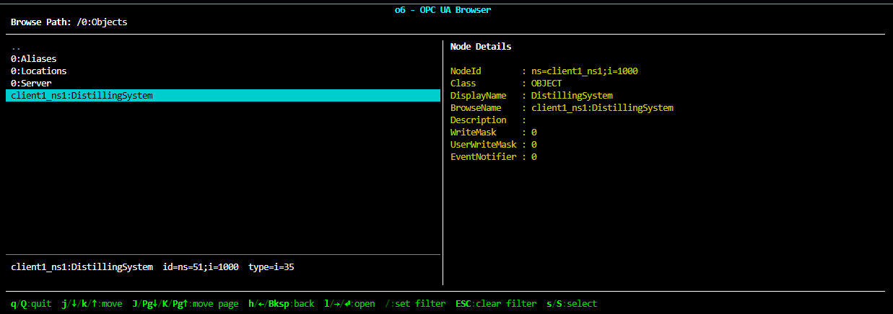

# Browse & Explore

Before you can read a value, call a method, or subscribe to anything, you need to know it's `NodeID`. Relying on statically assigned nodeids on the server side is in practice very error prone. The browse services let you traverse through the server's address space and retrive the NodeId for an element you are looking for.

This page walks through browsing primitives:

 - browsing interactively
 - using the browse service api
 - the client `__getitem__` syntax

This tutorial expects the [example server running](../setup.md) in the background.

---

## Browsing Interactively

When you're poking at a server you don't yet know well — discovering what it has is one of the first steps.

The o6\\Python `Client` ships with a very simple, light weight interactive browser for the command line.

```python
from o6 import Client

with Client("opc.tcp://localhost:4840") as client:
    selected = client.browseInteractive()
    # Arrow keys to explore the address space,
    # 's' to select the node under the curser and exit with it's nodeid/browse path
    # 'q' quits and returns None
    print(selected)
```

!!! info
    Requires the `curses` module (install `windows-curses` on Windows).

<div style="max-width: 660px; margin: 0 auto; padding: 0 1rem;">
  
</div>

You should see a command line program that lets you explore the server address space, starting at the server's root node.
On the top you see the current node's full browse path, the right hand side lists this node's child references.
The left hand side provides details about the selected node on the left side.
Use the arrow keys to navigate your curser and explore the server.
Move into the Objects node and you will see the DistillingSystem and a few details.
You can quit the browser by pressing `q`.

!!! tip
    Get familiar with the distilling example server and explore its structure

You can also pass a NodeId to drop straight into a known subtree:

```python
client.browseInteractive("ns=1;i=1000")   # start inside DistillingSystem
```

On quitting the interactive browser you can choose to return a NodeId as string or the full browse path from root as string as well:

```python
selected = client.browseInteractive()
```

```python
from o6 import Client

with Client("opc.tcp://localhost:4840") as client:
    selected = client.browseInteractive()
    # Arrow keys to explore the address space,
    # 's' to select the node under the curser and exit with it's nodeid/browse path
    # 'q' quits and returns None
    print(selected)
```

---

## The browse service

`client.browse(target)` is the no-frills browsing call: hand it a NodeId, get back a `list[ReferenceDescription]` of every reference coming out of that node. The default direction is **forward** and the default reference type is **HierarchicalReferences** (which includes `HasComponent`, `HasProperty`, `Organizes`, and their subtypes).

```python
from o6.ns.ns0.datatypes import BrowseResultMask

refs = client.browse("ns=1;i=1000", resultMask=BrowseResultMask.BROWSE_NAME | BrowseResultMask.NODE_CLASS)   # DistillingSystem
for ref in refs:
    print(ref.browseName.name, "→", ref.nodeId, ref.nodeClass.name)
```

Output (abbreviated):

```
Identification → ns=client1_ns1;i=1100 OBJECT
Status         → ns=client1_ns1;i=1200 OBJECT
Kettle         → ns=client1_ns1;i=1300 OBJECT
Distillate     → ns=client1_ns1;i=1400 OBJECT
Actuators      → ns=client1_ns1;i=1500 OBJECT
Events         → ns=client1_ns1;i=1600 OBJECT
Start          → ns=client1_ns1;i=2001 METHOD
Shutdown       → ns=client1_ns1;i=2002 METHOD
```

The `nodeId` here is a client-local `ExpandedNodeId`: the printed namespace index is `o6`'s shortname for the namespace (here `client1_ns1`, the slot `o6` assigned to `ns=1` on connect). The same node is still addressable as `"ns=1;i=1100"` for any subsequent `read` / `write` / `call` see [Namespaces in o6](http://localhost:8000/o6-python/manual/sdk-fundamentals/namespace/namespace-mapping-in-o6/#registry) Chapter in the manual.

This is what the interactive browser does in the background to fetch and display the child references of the currently selected node.

!!! info
    Per the OPC UA spec, a `ReferenceDescription`'s optional fields (`browseName`, `displayName`, `nodeClass`, `typeDefinition`) are only populated if you ask for them via `resultMask` — the default `resultMask=0` leaves them empty. `reftype` and `nodeId` are always returned regardless of the mask.

#### Putting it all together

```python
from o6 import Client
from o6.ns.ns0.datatypes import BrowseResultMask

with Client("opc.tcp://localhost:4840") as client:
    # 1. Start at DistillingSystem
    refs = client.browse("ns=1;i=1000", resultMask=BrowseResultMask.BROWSE_NAME | BrowseResultMask.NODE_CLASS)

    # 2. Pick the Kettle object and walk one level into it
    kettle = next(r.nodeId for r in refs if r.browseName.name == "Kettle")
    for ref in client.browse(kettle, resultMask=BrowseResultMask.BROWSE_NAME | BrowseResultMask.NODE_CLASS):
        print(ref.browseName.name, "—", ref.nodeClass.name)
```

!!! info
    `client.browse()` transparently follows server-issued **continuation points** by calling `BrowseNext` until the result is exhausted, so the list you get back is always complete even when the server splits a large result into multiple batches.

---

## Filtering the result

The real address space of a server is much busier than what you see in the interactive browser — every node also has `HasTypeDefinition`, `HasModellingRule`, inverse references, non-hierarchical references, and so on. The four filter parameters on `browse()` are how you cut that down.

**`direction=...`** — `FORWARD` (the default), `INVERSE`, or `BOTH`. Inverse is "who points at me?". Forward is "who do I point at?".

```python
# Who points at DistillingSystem? (answer: Objects folder)
refs = client.browse("ns=1;i=1000", direction=o6.ns.ns0.datatypes.BrowseDirection.INVERSE)
```

**`reftype=...`** — restrict to a specific reference type. The default is `HierarchicalReferences`, for example:

```python
# Only HasComponent edges (variables, methods, nested objects)
client.browse(
    "ns=1;i=1000",
    reftype=o6.ns.ns0.reftypes.HasComponent,
)
```

**`nodeClassMask=...`** — restrict the returned targets to specific node classes (`Object`, `Variable`, `Method`, …). Useful for "give me all the variables under this object":

```python
vars_only = client.browse(
    "ns=1;i=1000",
    nodeClassMask=NodeClass.VARIABLE,
)
```

#### Putting it all together — list every writable variable

A single browse, filtered to `Variable` nodes, gives you the writable surface of the still:

```python
import o6
from o6 import Client
from o6.ns.ns0.datatypes import BrowseResultMask, NodeClass

with Client("opc.tcp://localhost:4840") as client:
    writable = client.browse(
        "ns=1;i=1000",
        direction=o6.ns.ns0.datatypes.BrowseDirection.FORWARD,
        nodeClassMask=NodeClass.VARIABLE,
        resultMask=BrowseResultMask.BROWSE_NAME,
    )
    for ref in writable:
        print(ref.browseName.name, "→", o6.NodeId(f"nsu={ref.nodeId.ns.uri};{ref.nodeId.id}"))
```

!!! info
    Filtering at the server with `nodeClassMask` is cheaper than fetching everything and filtering in Python — the server only returns matches in its response.

!!! note "Server-side nodeClassMask caveat"
    A few OPC UA servers do not honour `nodeClassMask` on `Browse` and return all references regardless. If `browse(..., nodeClassMask=...)` comes back empty on a server that clearly does have children, drop the mask and filter client-side:

    ```python
    vars_only = [
        ref for ref in client.browse("ns=1;i=1000")
        if ref.nodeClass == o6.NodeClass.VARIABLE
    ]
    ```

    The distilling tutorial server is one of those — the documented `nodeClassMask=NodeClass.VARIABLE` filter above is correct, but if you see zero results, switch to the client-side filter.


## What is next

You have learned in this chapter:
 - Quickly getting an oveview of a server with the interactive browser
 - Using `client.browse(...)` to get a node's references
 - Server side filtering of references with `nodeClassMask` and `reftype`

Next you will learn how to [read and write](120_read-write-node.md) node values and attributes.
