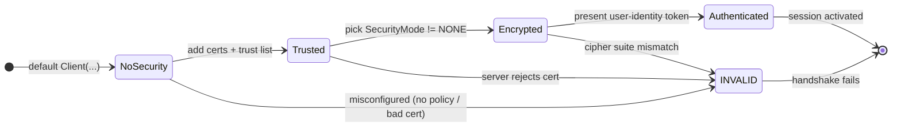

# Security — encrypted, authenticated client connections

The distillery has been running on an open channel — anyone on the network who can reach the server can browse it, read the Kettle values, write a new `Setpoint`, and call `Shutdown` on the still. That's fine while you're poking at the sim on a laptop, but the moment the server is on a real network with other machines on it, things need to change.

Two clients connect to the distillery in production: a **control plane** that runs the recipe (it needs to write the setpoint and start batches) and an **HMI dashboard** that an operator watches (it only needs to read, plus subscribe to events). They both speak to the same server on the same network. Without security, anything on the network can do anything the server exposes — including calling `Shutdown` on a running batch or writing `Setpoint` to dangerous values. Security gives us:

1. **Encryption** so nobody on the wire can read or tamper with the messages.
2. **Authentication** of the *channel* — both sides know they are talking to the party whose certificate they trust.
3. **Authentication of the *user*** — even once the channel is trusted, the server checks the user-identity token (`username`/`password`) before it accepts the session.

The default [`Client(...)`](../../api_reference/index.md) constructor opens an *unencrypted* channel (`SecurityPolicy.NONE` / `SecurityMode.NONE`). For production use you almost always want a properly encrypted connection with mutual certificate trust.



A few things worth knowing about this diagram:

- **`NoSecurity`** is the default. The channel is open and the server is reached, but every byte is plaintext on the wire. The session is anonymous — there's no `username`/`password`.
- **`Trusted`** means both sides have each other's certificates in their trust list. The handshake can move forward; the server knows who it's talking to and will accept the connection.
- **`Encrypted`** means a `SecurityPolicy` and `SecurityMode` have been negotiated (anything other than `INVALID` / `NONE`). Messages are signed and/or encrypted end-to-end.
- **`Authenticated`** means the `ActivateSession` step succeeded — the server accepted the user-identity token (`username`/`password` for the distillery) and the session is fully usable.
- **`INVALID`** is the value returned when the negotiation *failed* — wrong policy, mismatched mode, bad cipher, untrusted cert, missing trust list, or a `UserTokenPolicy` the server doesn't accept. Anything that lands the connection in `INVALID` means the handshake was rejected and `client.connect()` raises.

This page walks step by step through the security basics:

- Generate (or load) a client certificate and private key.
- Exchange certificates with the server so each side trusts the other.
- Pick a `SecurityPolicy` and `SecurityMode`, and decide on a `UserTokenPolicy`.
- Build the `Client` with the security arguments and connect.
- Spot which transitions in the state diagram fail and what `INVALID` looks like at the wire level.

!!! info
    This tutorial expects the [example server running](../../tutorials.md#running-the-example-server) in the background, and assumes you know how to [create and connect](100_connect.md) a client, how to [browse](110_browse.md) the address space, and how to [read and write](120_read-write-node.md) values. The snippets use the distillery's `DistillingSystem` at `ns=1;i=1000` and the writable `Status.Setpoint` at `ns=1;i=1204` to illustrate the *who can write what* part.

!!! warning
    The packaged `examples/example-server/server.py --sim` doesn't take certificate/trust-list/`UserTokenPolicy` arguments, so it always runs with `SecurityMode.NONE` and anonymous sessions. The `connect()` calls below that pass `securityMode=`, `trustList=`, or `username=`/`password=` will fail against it — they document the `Client(...)` side of the handshake, but exercising them end-to-end needs a server started with the matching certificate, trust list, and `UserTokenPolicy` configured on the `Server(...)` side (see the constructor arguments in the [Server API reference](../../api_reference/index.md)).

---

## Generate or load a certificate and private key

A server uses certificates and distributes them to trusted clients. If a client wants to interact with the server, it needs to present authorization. The same way, a server needs a certificate, so the client can trust the server and its data.

OPC UA uses X.509 certificates. If you don't already have one, `o6.util` can generate a self-signed pair:

```python
from o6.util import createSelfSignedCertificate

cli_key, cli_cert = createSelfSignedCertificate(
    appUri="urn:example:client",
    commonName="ExampleClient@localhost",
)
```

The returned objects are raw `bytes` in DER format. You can also write them to disk and load them back later:

```python
Path("client_key.der").write_bytes(cli_key)
Path("client_cert.der").write_bytes(cli_cert)
```

For the distillery, give the *control-plane* client a distinct URI (e.g. `urn:example:control-plane`) and the *HMI dashboard* a different one (e.g. `urn:example:hmi`) so the server's `UserTokenPolicy` can distinguish them.

!!! tip
    o6\\Python accepts the certificate and key as `bytes`, as a `pathlib.Path`, or as a path string — pick whichever is most convenient for your project.

---

## Exchange certificates with the server

The server needs to *trust* the client's certificate, and the client needs to *trust* the server's. In a real deployment you'd hand both certificates to the operators of the other side; for development you can load each side's certificate into your local trust store and let `o6` pass them along.

The way you tell `o6` which server certificates to trust is the `trustList=` argument to `Client`. You also need to make sure the **`applicationUri`** on the client matches the `ApplicationUri` that ends up in the client certificate — the simplest way to guarantee that is to pass the same URI both to `createSelfSignedCertificate(appUri=...)` and to the client constructor.

```python
from o6.util import createSelfSignedCertificate
from pathlib import Path

# Generate *both* sides for a local round-trip test
cli_key, cli_cert = createSelfSignedCertificate(
    appUri="urn:example:client",
    commonName="ExampleClient@localhost",
)
srv_key, srv_cert = createSelfSignedCertificate(
    appUri="urn:example:server",
    commonName="ExampleServer@localhost",
)

# Persist so the server can be started with the matching certificate
Path("client_key.der").write_bytes(cli_key)
Path("client_cert.der").write_bytes(cli_cert)
Path("server_key.der").write_bytes(srv_key)
Path("server_cert.der").write_bytes(srv_cert)
```

!!! info
    The server should be started with `client_cert.der` in its `trustList=` so it accepts the client you just generated. See [Server](../../server.md) for the server-side constructor.

---

## Pick a security policy, mode, and user token

OPC UA separates the *algorithm suite* from the *level of protection* and from the *who are you?* question:

- **`securityPolicy=`** chooses the cryptographic suite — the algorithms used for signing and encrypting messages.
- **`securityMode=`** chooses what is applied to each message — sign only, or sign *and* encrypt.
- **`username` / `password`** are the `UserTokenPolicy` the client presents to the server's `activate_session` step. The server decides which `UserTokenPolicy`s it accepts and what each one is allowed to do.

`o6` exposes both the policy and the mode as enums in the top-level namespace:

```python
from o6 import SecurityPolicy, SecurityMode

policy = SecurityPolicy.BASIC256SHA256
mode   = SecurityMode.SIGN_AND_ENCRYPT
```

`SecurityPolicy` choices (newest at the top): `AES256_SHA256_RSAPSS`, `AES128_SHA256_RSAOAEP`, `BASIC256SHA256`, `BASIC256`, `BASIC128RSA15`. The last two are deprecated and should not be used for new connections.

`SecurityMode` choices are the values you'll see on the wire and on the `client.config` after a successful connect:

| Mode | What it means | What it leaves you open to |
|---|---|---|
| `INVALID` | Negotiation failed — the server returned an `INVALID` value or the client was misconfigured. `connect()` raises. | Nothing usable: there is no secure channel. This is the *failure* value, not a mode you'd set. |
| `NONE` | No signing, no encryption. The default `Client(...)` constructor opens this channel. | Anyone on the wire can read and tamper with messages. Use only for local development. |
| `SIGN` | Every message is signed, but not encrypted. Tampering is detected; contents are still readable. | Passive eavesdroppers can see the values. |
| `SIGN_AND_ENCRYPT` | Every message is both signed and encrypted. The strongest mode. | Nothing on the wire. |

`SIGN_AND_ENCRYPT` is the strongest — every message is both authenticated and encrypted. The distillery should run in `SIGN_AND_ENCRYPT` for both the control plane and the HMI; the *only* difference between the two is the user-identity token below.

For the distillery, a typical split is:

- **HMI dashboard:** `SecurityMode.SIGN_AND_ENCRYPT` + `username="hmi"`, `password=...`. The server's `UserTokenPolicy` for `hmi` allows reads and event subscriptions but rejects writes to `Status.Operating` and `Status.Setpoint` and rejects `Start`/`Shutdown` calls.
- **Control plane:** `SecurityMode.SIGN_AND_ENCRYPT` + `username="control"`, `password=...`. The `control` token policy allows everything.

The same encrypted channel, the same certificates — only the user token differs. The server's `UserTokenPolicy` is what makes the difference: a write attempt from `hmi` to `Status.Setpoint` returns `BadUserAccessDenied` even though the channel itself is fine.

---

## Build the secure client

Now combine everything: the URL, the certificate, the key, the trust list, the policy, the mode, the application URI, and the user token. These are all keyword arguments on `Client`:

```python
from pathlib import Path
from o6 import Client, SecurityPolicy, SecurityMode

client = Client(
    "opc.tcp://localhost:4840",
    certificate     = Path("client_cert.der"),
    privateKey     = Path("client_key.der"),
    trustList      = [Path("server_cert.der")],
    securityMode   = SecurityMode.SIGN_AND_ENCRYPT,
    securityPolicy = SecurityPolicy.BASIC256SHA256,
    applicationUri = "urn:example:client",
    username        = "control",
    password        = "s3cr3t",
)
```

You can pass the certs as `bytes`, as `Path` objects, or as path strings — `o6` accepts all three.

We can now `connect()` the client:

```python
# tutorial-check: skip — the example server intentionally has no secure endpoint
client.connect()
print(client.connected)   # True
client.disconnect()
```

If the server is configured with a matching `trustList` (it must contain `client_cert.der`), a compatible policy, and a `UserTokenPolicy` that accepts the `username`/`password`, the handshake completes and the channel is encrypted and authenticated — the channel walks the full `NoSecurity -> Trusted -> Encrypted -> Authenticated` path in the state diagram. If anything in the trust chain, the policy negotiation, or the `activate_session` step is off, `connect()` raises — the most common cause is the server not trusting the client cert, which surfaces as a `BadSecurityChecksFailed` or similar status code.

!!! info
    To see the HMI side: build the same client but with `username="hmi"`. The connect succeeds, but `client.write("ns=1;i=1204", 90.0)` returns `BadUserAccessDenied` because the server's `hmi` `UserTokenPolicy` doesn't permit writing `Status.Setpoint`. The control plane's write of the same value succeeds.

#### Putting it all together

```python
# tutorial-check: skip — requires the matching secure server configuration
from pathlib import Path
from o6 import Client, SecurityPolicy, SecurityMode

# Control plane: can read, write, call methods.
with Client(
    "opc.tcp://localhost:4840",
    certificate=Path("client_cert.der"),
    privateKey=Path("client_key.der"),
    trustList=[Path("server_cert.der")],
    securityMode=SecurityMode.SIGN_AND_ENCRYPT,
    securityPolicy=SecurityPolicy.BASIC256SHA256,
    applicationUri="urn:example:client",
    username="control",
    password="s3cr3t",
) as client:
    # Read the current state
    setpoint = client.read("ns=1;i=1204")
    print("setpoint:", setpoint)

    # Write a new setpoint (allowed for the "control" user)
    status = client.write("ns=1;i=1204", 90.0)
    print("write status:", status)
```

---

---

## What `INVALID` looks like in practice

When the handshake fails, the connection never makes it to `Authenticated` — it stalls in the `INVALID` corner of the state diagram. The failure mode is one of:

- **`policy` mismatch.** The client asked for `BASIC256SHA256`, the server only supports `AES256_SHA256_RSAPSS`. The server returns an `INVALID` security mode in its `GetEndpoints` response and the client refuses to connect.
- **`mode` rejected.** The client asked for `SIGN` but the server only accepts `SIGN_AND_ENCRYPT` on that endpoint. Same outcome: `INVALID` in the response.
- **Cert not in trust list.** The server doesn't trust `client_cert.der`. The server returns a `BadSecurityChecksFailed` status code at `CreateSession`.
- **ApplicationUri mismatch.** The `applicationUri` on the client constructor doesn't match the URI inside `client_cert.der`. open62541 enforces this on cert-based channels and the handshake fails.
- **`UserTokenPolicy` rejected.** The username/password is correct but the server's policy table doesn't have that user. `ActivateSession` returns `BadIdentityTokenRejected`.

For the distillery, two failure cases are worth trying on purpose to see the difference:

- **Connect the control-plane cert with a `NONE` security mode** — the channel opens (`NoSecurity` in the diagram), `connect()` succeeds, but `client.config.securityMode` is `NONE` and you're back to plaintext on the wire.
- **Connect the control-plane cert with `username="hmi"`** — the channel reaches `Encrypted` (cert + policy are fine), but the user-identity token is wrong and `ActivateSession` returns `BadIdentityTokenRejected`. `connect()` raises.

A handy diagnostic: ask the server what endpoints it offers and which policy/mode each one supports, then compare against what your client requested:

```python
# tutorial-check: skip — uses the secure client configured above
endpoints = client.getEndpoints("opc.tcp://localhost:4840")
for ep in endpoints:
    print(ep.securityPolicyUri, ep.securityMode, ep.userIdentityTokens)
```

If you see the policy URI you configured, a non-`NONE` mode, and the `UserTokenPolicy` you used, the server is advertising the secure endpoint you're on. To confirm the *actual* channel you're on, look at `client.config.securityPolicy` and `client.config.securityMode` after a successful `connect()`:

```python
print("policy:", client.config.securityPolicy)
print("mode:  ", client.config.securityMode)
```

Both should match what you passed in. If either is `NONE`, the handshake fell back to an insecure channel and something in the configuration is off. If `connect()` raised and the stack trace mentions a `StatusCode` starting with `BadSecurity*` or `BadIdentity*`, you landed in the `INVALID` corner of the state diagram and the configuration needs to be aligned between client and server.

---

## What's next?

- [Application Description](310_application-description.md) —
- [Low-level service calls](500_lowlevel-service-calls.md) — use the raw `ActivateSession` request if you need a custom user identity token (certificate, issued token, …) beyond `username`/`password`.
